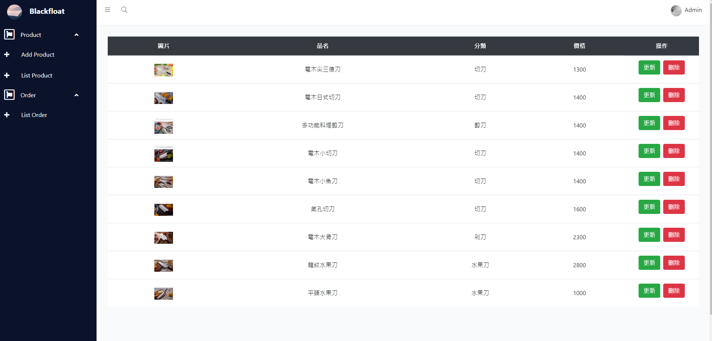

# 菜刀-電商網站

*這個網站是紀念以前大學打工時，那時想幫老闆做一個電商網站，但礙於那時對網站開發一竅不通，直到畢業後有了能力才將網站做出來。

[Demo](http://35.236.180.209:3000/#/)

# 介紹
* 前端使用vue-cli
* 後端依然使用koa搭配mongodb
* 驗證由session改為jwt

## Get start
* 先將資料庫匯入

```
$ cd db/shopping_db
$ mongorestore -d shopping_web  ./shopping_web
```

* front-end 
```
$ cd vue
$ npm i
$ npm run dev 
```

* back-end

```
$ cd server
$ npm i
$ npm start 
```


## 後台
* http://35.236.180.209:3000/#/login
* 帳號:admin 密碼:admin
* 目前只能新增產品以及查看訂單

